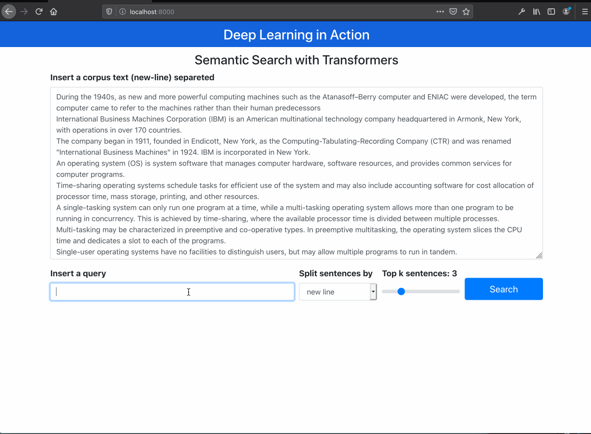
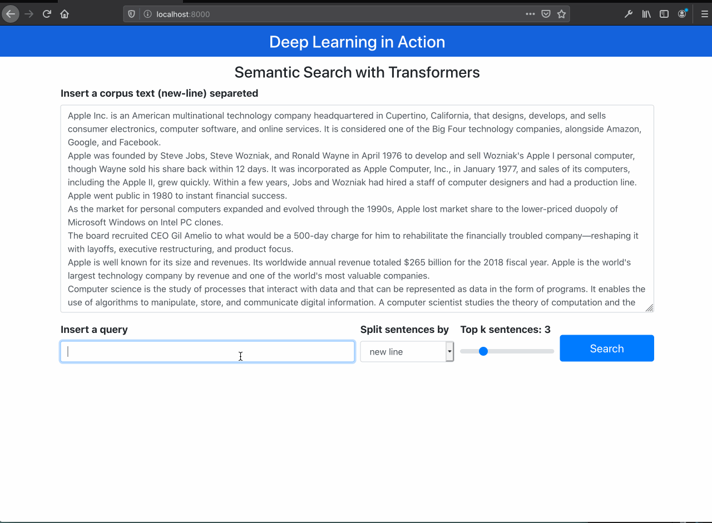
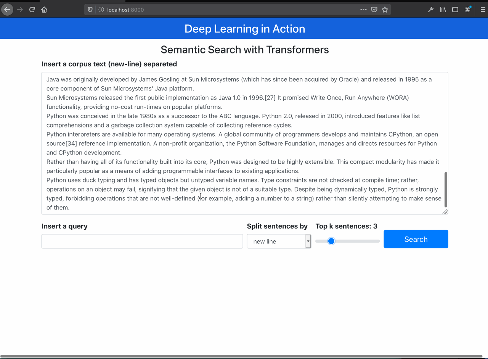

# Semantic Search using sentence embeddings from Transformers models and others
Simple application using sentece embedding to project the documents in a high dimensional space and find most similarities using cosine similarity.

The purpose is to demo and compare the models. To deploy in scale, it is necessary to compute and save the document embeddings to quickly search and compute similarities.

The first load take a long time since the application will download all the models. Beside 6 models running, inference time is acceptable even in CPU.

### Application
The demo text has 4 sentences about each topic: Apple, Operating Systems, Java and Python.

It is possible to see the semantic search works well filtering out only documents about the specific query, even tought the query doesn't have the exaclty words in documents.

The Raw BERT performs poorly (as expected)

#### Searching for Apple


#### Searching for OS


#### Searching for Java


#### Searching for Python


### Running 
It is necessary to download the [Infersent model 1](https://github.com/facebookresearch/InferSent) and [glove.840B.300d.txt](http://nlp.stanford.edu/data/glove.840B.300d.zip).

Download and put the files in the infersent_files in each respective folders.

```
python app.py
```

Open your browser http://localhost:8000


